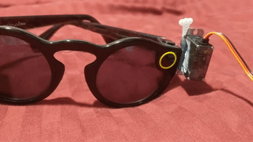

# Spectacles Servo

Control a [Snapchat Spectacles](https://www.spectacles.com/) with a [servo](https://www.tammieshobbies.com/collections/servos-and-accessories/products/eflite-7-6-gram-digi-servo) (+Arduino)

## Build

To get this project built, you need a servo glued to your Spectacles. The servo I used can [be found here](http://www.e-fliterc.com/Products/Default.aspx?ProdID=EFLRDS76). I used [Krazy Glue with precision tip](http://www.krazyglue.com/product/details/maximum-bond-krazy-glue-with-extended-precision-tip) to actually glue it to the glasses.

There are two pieces of code here:

 1. `driver.ino`: Uploads to your Arduino, I used a Teensy 3.2. Depending on your Arduino, you may need to change `SERVO_PWM_PIN` in it.
 2. `server.js`: So you can send an empty GET to `http://127.0.0.1:9969/push` (default) and that pushes the servo. You also need `npm install serialport`.
